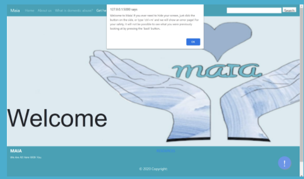
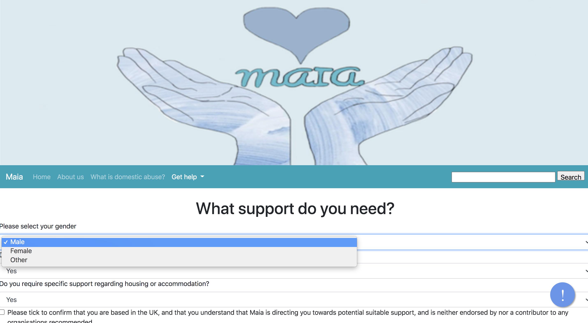

# codingsaveslives
## Maia:</strong> 'love' and 'mother'
  

The name <i><strong>Maia</strong></i> was specially chosen to create ambiguity. Maia seems like a generic or even a foreign name so an abuser would not easily conclude what their victim is doing.  
Additionally, we wanted the name to have a hidden and deep meaning hence the name Maia - <i>Mother, love.</i>
A safety button is also added on the left hand corner which leads to an ERROR 404 page. Once on this page, you cannot go back to the platform unless you have the web link.

### Mission
Our mission for this project was to create a safe platform where victims of domestic abuse can go and get help. This directory leads a person to specific organisations based on the requirements they chose.
 
This is our code repository for our CFG Hackathon - Maia
 

